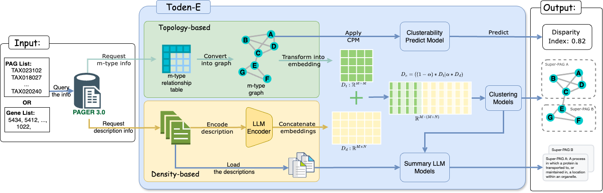

# GOLDEN-F
This code release accompanies the following paper:


## GOLDEN-F: Graph-Oriented Learning with Domain-Embedding Network Fusion for Super-PAG Development in Functional Genomics

Qi Li, Cody Nichols, Robert S Welner, Jake Y. Chen, Wei-Shinn Ku1 and Zongliang Yue

### Abstract
<sup>TMotivation: The integrative analysis of gene sets, networks, and pathways is pivotal for deciphering omics data in translational biomedical research. To significantly increase gene coverage and enhance the utility of pathways, annotated gene lists, and gene signatures from diverse sources, we introduced pathways, annotated gene lists, and gene signatures (PAGs) enriched with metadata to represent biological functions. Furthermore, we established PAG-PAG networks by leveraging gene member similarity and gene regulations. However, in practice, high similarity in descriptions and gene membership often produces redundant, lengthy PAG lists, leading to geneset enrichment results that are difficult to interpret.
Results: We present GOLDEN-F (Graph-Oriented Learning with Domain-Embedding Network Fusion), an integrative framework that jointly leverages (i) connection-based embeddings derived from PAG–PAG relationships and (ii) semantic-based embeddings learned from PAG descriptions with large language models. The two representations are combined via early fusion with a tunable weighting to produce a unified embedding on which clustering identifies concise, higher-level super-PAGs. To assess when clustering is appropriate, we introduce a Connection Disparity Index (CDI), trained on synthetic stochastic block models to predict network “clusterability”. We further stabilize results with consensus clustering. On Gene Ontology Annotation (GOA) biological process benchmarks, GOLDEN-F recovers “is-a” structure more accurately than either connection-only or semantic-only baselines, demonstrating consistent gains in Adjusted Rand Index and Normalized Mutual Information. Finally, we generate summaries for each super-PAG by synthesizing its member PAG descriptions with an LLM, improving interpretability without manual curation. </sup>



## Setup

1) Clone the repo:  

```bash
git clone https://github.com/ai-pharm-AU/Toden-E.git
```

2) Install the Python packages (we used Python 3.10): 

```bash
cd Toden-E
conda env create -f environment.yml
conda activate toden_e
```

## Running Toden-E

1) Discover the super-pags with a list of gene:

```python
python toden_e.py --func super_pag --file_path file_name.txt
```

2) Compute the Dipartion Score: 

```
python toden_e.py --func dipartion_score --file_path file_name.txt

```

3) Visualizaiton for the super-pags

```
python toden_e.py --func vis --clusering_results_path predict_results.csv

```

4) Summerization for the super-pags

```
python toden_e.py --func summerization --clusering_results_path predict_results.csv

```
